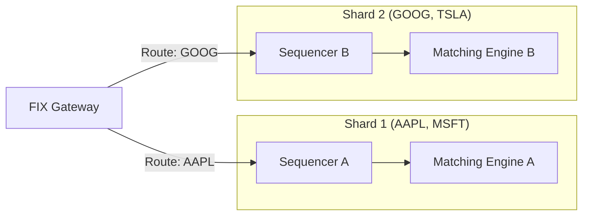

# Chronos System Architecture

## High-Level Overview

Chronos is a low-latency trading system built on top of [Aeron](https://github.com/real-logic/aeron) and [Agrona](https://github.com/real-logic/agrona). It is designed to minimize gc-pauses and provide deterministic execution sequencing.

### System Components

```mermaid
graph TD
    Client[FIX Client] -->|TCP / FIX| Gateway[FIX Gateway]
    
    subgraph "Chronos Node (Pinned Cores)"
        Gateway -->|Aeron IPC / UDP| Sequencer[Aeron Cluster Sequencer]
        Sequencer -->|Raft Log| Matcher[Matching Engine Service]
    end
    
    Matcher -->|Execution Report (SBE)| Gateway
    Gateway -->|FIX ExecutionReport| Client
    
    subgraph "Shared Memory (Off-Heap)"
        LogBuffer[Aeron Log Buffer]
        OrderBook[Off-Heap OrderBook]
    end
    
    Sequencer -.-> LogBuffer
    Matcher -.-> OrderBook
```

## Data Flow

1. **Ingress**: 
   - Clients connect via TCP to the `FixGateway`.
   - The Gateway parses FIX messages using a zero-allocation parser.
   - Validated messages are encoded into SBE (Simple Binary Encoding) and written directly to the Aeron Publication buffer (`tryClaim`).

2. **Sequencing**:
   - The Aeron Cluster Leader receives the message.
   - The message is sequenced and replicated to Followers via Raft.
   - Once committed, the message is effectively "immutable" in the log.

3. **Processing (Matching)**:
   - The `ChronosClusteredService` reads the committed message.
   - It invokes the `MatchingEngine`.
   - The engine uses SIMD instructions (`jdk.incubator.vector`) to scan the `OffHeapOrderBook`.
   - Orders are matched or rested.
   - State changes are deterministic based on the input stream.

4. **Egress**:
   - Execution Reports are generated as SBE messages.
   - These are sent back to the Gateway via an Aeron Subscription.
   - The Gateway translates SBE back to FIX and sends it to the Client.

## Memory Model

Chronos relies heavily on **Off-Heap Memory** to avoid Java Garbage Collection (GC) pauses.

- **Agrona Buffers**: `UnsafeBuffer` is used wrapping `ByteBuffer.allocateDirect()`.
- **Flyweights**: Objects like `NewOrderSingleDecoder` are flyweights that wrap the underlying buffer bytes, creating no new objects per message.
- **Data Structures**: The `OffHeapOrderBook` uses fixed-size memory blocks effectively acting as an array-based linked list, managed manually.

## Threading Model

To achieve microsecond-level latency, Chronos pins critical threads to specific CPU cores.

- **Gateway Thread**: Handles TCP NIO selector and Aeron Publication.
- **Sequencer/Matching Thread**: A single thread (the "ClusteredService" agent) that processes the Raft log and runs the matching logic. This ensures zero locking is required for the OrderBook.
- **Media Driver**: Dedicated threads for Aeron IO (Receiver, Sender, Conductor).

## Sharding Strategy

Chronos scales horizontally by sharding instruments across multiple Aeron Cluster instances.



The `InstrumentRouter` in the Gateway determines the destination Shard ID based on the symbol.
